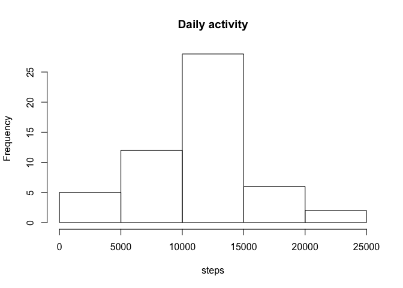
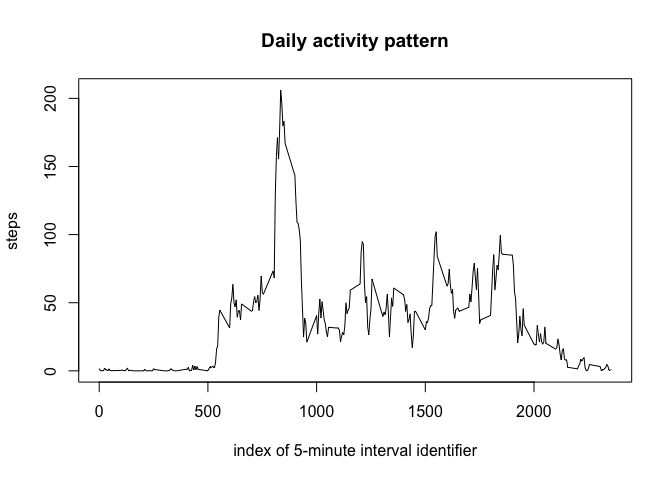
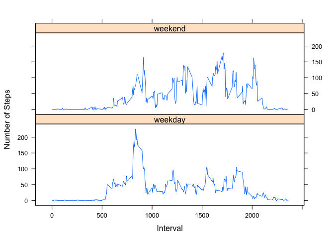

# Reproducible Research: Peer Assessment 1


## Loading and preprocessing the data

Loading the needed libaries

```r
library("dplyr")
library("lubridate")
```

Reading the data and transforming data.frame to tibble for better performance and nice prints. 
Setting up the date correctly. 


```r
activity <- read.csv(unzip("activity.zip"))
activity <- tbl_df(activity)
activity <- mutate(activity,  date=ymd(date))
head(activity)
```

```
## # A tibble: 6 <U+00D7> 3
##   steps       date interval
##   <int>     <date>    <int>
## 1    NA 2012-10-01        0
## 2    NA 2012-10-01        5
## 3    NA 2012-10-01       10
## 4    NA 2012-10-01       15
## 5    NA 2012-10-01       20
## 6    NA 2012-10-01       25
```

## What is mean total number of steps taken per day?

Calculating the total number of steps taken per day and plotting a histogram:

```r
activityByDate <- summarise(group_by(activity, date), sum(steps))
hist(activityByDate$`sum(steps)`, xlab = "steps", main ="Daily activity")
```

<!-- -->

Calculating the mean and meadian for total number of steps taken per day and ignoring missing values. 

The mean number of steps per day: 

```r
meanSteps <- mean(activityByDate$`sum(steps)`, na.rm = TRUE)
meanSteps
```

```
## [1] 10766.19
```

The median number of step per day: 

```r
medianSteps <- median(activityByDate$`sum(steps)`, na.rm = TRUE)
medianSteps
```

```
## [1] 10765
```

## What is the average daily activity pattern?

Calculating the mean number of steps per interval 

```r
activityByInter <- summarise(group_by(activity, interval), steps = mean(steps, na.rm=TRUE))
```

Plotting the daily activity pattern. 

```r
plot(activityByInter, type="l", xlab ="index of 5-minute interval identifier", main = "Daily activity pattern")
```

<!-- -->

Finding the 5-minute interval that on average contains the maximum number of steps

```r
activityByInter$interval[which.max(activityByInter$steps)]
```

```
## [1] 835
```

## Imputing missing values
Calculating the number of missing values in the data


```r
missing <- sum(is.na(activity$steps))
proportion <- mean(is.na(activity$steps))
```

The steps data has 2304  rows with missing values which is 0.1311475% of the data.

The missing values are replaced with the interval mean.

```r
activityNa <-  activity %>%
    group_by(interval) %>% 
    mutate(steps = ifelse(is.na(steps), mean(steps, na.rm=TRUE), steps))
```

Re-doing the analyses with missing values filled.


```r
activityByDate <- summarise(group_by(activityNa, date), sum(steps))
hist(activityByDate$`sum(steps)` , xlab = "steps", main ="Daily activity")
```

<!-- -->

Calculate the median and mean

```r
meanStepsNa <- mean(activityByDate$`sum(steps)`, na.rm = TRUE)
medianStepsNa <- median(activityByDate$`sum(steps)`, na.rm = TRUE)
```

Make a nice table of the results to high light the differences. 

```r
meanMedian <- data.frame( NAs.filed = c(meanStepsNa, medianStepsNa), 
                         NAs.removed = c(meanSteps, medianSteps), row.names = c("mean",                             "median"))
meanMedian
```

```
##        NAs.filed NAs.removed
## mean    10766.19    10766.19
## median  10766.19    10765.00
```

Based on the calculated means and medians adding the missing data has very little effect to the results. This is mainly because there is such a low amount of missing values (2304) compared to the total amount of values available (17 568). 

## Are there differences in activity patterns between weekdays and weekends?


```r
activityNa <-mutate(activityNa, weekend= ifelse(wday(date) == c(1,7), 
                                                "weekend", "weekday"))
```


Loading the needed libary

```r
library("lattice")
```

Plotting the activity and separating weekends and weekdays to separate plots. 

```r
activityWeek <- summarise(group_by(activityNa, weekend, interval), steps = mean(steps))

with(activityWeek, (xyplot(steps~interval|weekend, type="l", layout = c(1,2), xlab = "Interval", ylab = "Number of Steps")))
```

<!-- -->


